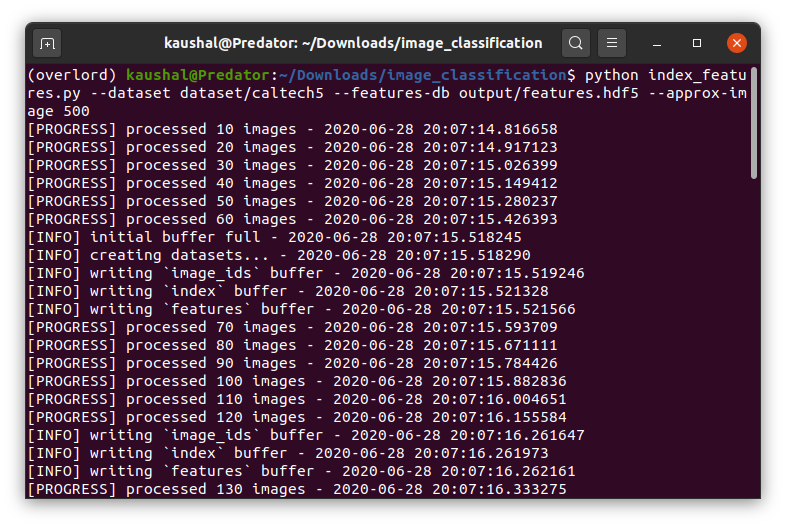
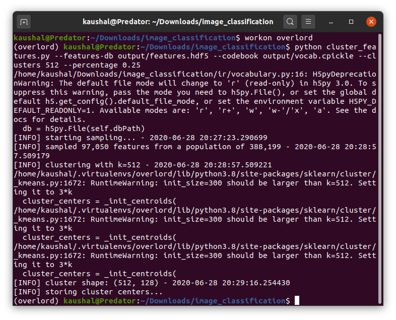
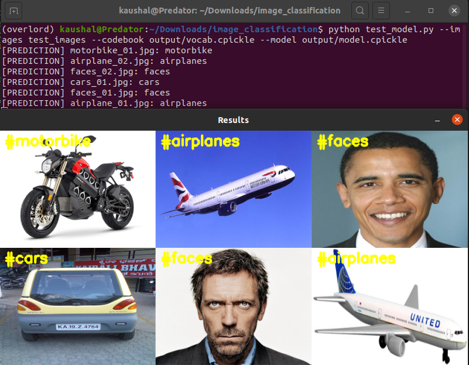

# Image Classification on Caltech5 Dataset

Applying **Bag-of-visual-words model and supervised learning** to the task of image classification.
I'll be training five classes and train the classifier to distinguish between these object categories namely *airplanes, cars, faces, guitars, motorbikes*.
I have also used GridSearch for tuning the parameters for higher accuracy.

## Goals:
1. Extracting a BOVW representation for each image in the dataset
2. Training the classifier
3. Tuning the hyperparameters
4. Testing the model

## The Dataset:

The CALTECH-5 dataset is a subset of the CALTECH-101 dataset and includes five categories of images: airplanes, cars, faces, motorbikes, and guitars. Each class contains 100 images for a total of 500 images in the dataset.


### Requirements:

1. Extract output/features.7z file in the output directory

2. Install the dependancies 
```
pip install -r requirements.txt
```

I'll be using OpenCV 4 for this project and I would recommend to follow this [guide to install OpenCV 4](https://www.pyimagesearch.com/2018/08/15/how-to-install-opencv-4-on-ubuntu/). 
Don't forget to turn on the OPENCV_ENABLE_NONFREE flag while installing. The guide which I have linked have the instructions to do that.

## Skip the hassel and test on your images

To run the code on pre-defined model and pre-defined feature vectors, put any image on the test folder and run:
```
$ python test_model.py --images test_images --codebook output/vocab.cpickle --model output/model.cpickle
```

## Run the code from start

If you want to include additional data of your own or start from sratch, follow these steps

#### 1. Extract the features

The first step is to extract the features from each images in the dataset 
```
$ python index_features.py --dataset dataset/caltech5 --features-db output/features.hdf5 --approx-images 500
```

After the script has finished running, you should have output/features.hdf5 file.



#### 2. Cluster the features
```
$ python cluster_features.py --features-db output/features.hdf5 --codebook output/vocab.cpickle --clusters 512 --percentage 0.25
```
After the script has finished running, you should have output/vocab.pickle file.



#### 3. Construct a BOVW histogram representation
```
$ python extract_bovw.py --features-db output/features.hdf5 --codebook output/vocab.cpickle \
	--bovw-db output/bovw.hdf5
```
Once finished, you should find a bovw.hdf5 file in your output directory

#### 4. Training the Classifier
```
$ python train_model.py --dataset caltech5 --features-db output/features.hdf5 \
	--bovw-db output/bovw.hdf5 --model output/model.cpickle
```

#### 5. Testing the Classifier

```
$ python test_model.py --images test_images --codebook output/vocab.cpickle --model output/model.cpickle
```



## Author - Kaushal Bhavsar


